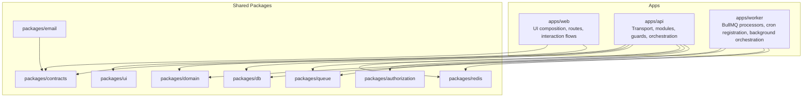

# Tourna

<p align="center">
  <strong>Tournament management platform for e-sports and traditional competitions.</strong>
</p>

<p align="center">
  Built as a long-term monorepo focused on maintainability, explicit architecture, typed boundaries, and portfolio-grade engineering quality.
</p>

<p align="center">
  
  
  
  
  
</p>

> [!IMPORTANT]
> This repository is documented for GitHub-first reading. Internal links use repository-relative paths, headings are anchor-friendly, and the docs intentionally prefer GitHub-supported Markdown features.

## Why This Project Exists

Tourna exists for two reasons at the same time:

1. build a real application for managing tournaments, scrims, registrations, roles, and operational flows
2. build a public repository that demonstrates mature software engineering, not just feature delivery

This is not intended to be a fast prototype or a vibe-coded demo. The codebase is being shaped as something that should still make sense after growth, refactors, and new contributors.

## What Tourna Is

Tourna is a platform for managing competitive events across both e-sports and traditional formats.

The product direction includes:

- structured tournaments
- scrims and friendly matches
- player and team registrations
- membership and role-based access
- tournament progress and event operations

The goal is to support increasingly complex workflows without losing clarity in either product behavior or code ownership.

## Documentation Map

| Document | Purpose |
| --- | --- |
| [CONTRIBUTING.md](./CONTRIBUTING.md) | Collaboration policy and contribution expectations |
| [docs/background-jobs.md](./docs/background-jobs.md) | Queue, worker, and cron behavior |
| [docs/storage.md](./docs/storage.md) | Storage flows and object lifecycle |
| [docs/repository-documentation.md](./docs/repository-documentation.md) | GitHub-friendly documentation conventions for this repo |
| [packages/db/README.md](./packages/db/README.md) | Database package overview and migration workflows |
| [packages/redis/README.md](./packages/redis/README.md) | Redis models, scripts, pipelines, and session primitives |
| [packages/queue/README.md](./packages/queue/README.md) | Queue contracts, job definitions, and producers |
| [packages/email/README.md](./packages/email/README.md) | Email contracts, templates, and provider abstractions |
| [AGENTS.md](./AGENTS.md) | Root bridge for repository instructions |
| [.codex/AGENTS.md](./.codex/AGENTS.md) | Repo-wide AI engineering defaults |

## Portfolio Intent

This repository is meant to show how software should feel when the target is not only correctness, but also:

- architectural discipline
- long-term maintainability
- explicit contracts and boundaries
- scalable project organization
- code that stays understandable under change

In practical terms, Tourna is as much about codebase stewardship as it is about features.

## Core Product Areas

| Area | Focus |
| --- | --- |
| Authentication | Secure signup, login, refresh, session lifecycle |
| Authorization | Scoped permissions, memberships, access policies |
| Tournament Core | Tournament lifecycle and related entities |
| Participation | Registration and participation flows |
| Operations | Event progress, management tooling, administrative workflows |

## Architecture Snapshot



The design principle is simple: keep apps thin, keep package ownership explicit, and prevent product logic from dissolving into framework glue.

<details>
<summary>Monorepo structure</summary>

| Path | Responsibility |
| --- | --- |
| `apps/web` | Next.js frontend |
| `apps/api` | NestJS API with Fastify |
| `apps/worker` | NestJS application context for BullMQ workers and cron jobs |
| `packages/contracts` | Shared Zod schemas and Nest-facing DTOs |
| `packages/domain` | Framework-agnostic domain types and shared vocabulary |
| `packages/db` | PostgreSQL integration, schema typing, migrations |
| `packages/redis` | Redis engines, models, pipeline/multi, Lua-backed session primitives |
| `packages/queue` | BullMQ contracts, producers, queue names, and cron registrations |
| `packages/email` | Transactional email templates, renderer, and provider abstractions |
| `packages/authorization` | Shared authorization primitives and ability logic |
| `packages/ui` | Shared UI primitives |
| `.codex` | Repository-local instructions for AI-assisted engineering workflows |

</details>

## Tech Stack

| Layer | Technology |
| --- | --- |
| Frontend | Next.js 16, React 19 |
| Backend | NestJS 11, Fastify, Swagger |
| Contracts | Zod |
| Persistence | PostgreSQL, Kysely |
| Cache / Sessions | Redis |
| Background Jobs | BullMQ |
| Monorepo | pnpm, Turborepo |
| Language | TypeScript |
| Tooling | ESLint, Prettier, Jest |

## Engineering Standards

The repository follows a few non-negotiable standards:

- prefer durable design over the shortest implementation
- keep contracts, domain, transport, persistence, and UI concerns separate
- avoid convenience abstractions that blur ownership
- treat lint, type safety, and tests as required quality gates
- refactor around touched areas when it improves structural clarity

If a change works but degrades the architecture, it is not considered good enough.

## Local Development

### Install dependencies

```sh
pnpm install
```

### Start infrastructure

```sh
docker compose -f docker/docker-compose.yml up -d
```

This brings up PostgreSQL, Redis, and Mailpit. The Mailpit inbox is available at `http://localhost:8025`.

### Run the frontend

```sh
pnpm --filter web dev
```

### Run the API

```sh
pnpm --filter api dev
```

### Run the worker

```sh
pnpm --filter worker dev
```

## Quality Gates

Run from the repository root:

```sh
pnpm lint
pnpm check-types
pnpm test
```

Use filtered commands for narrow changes when appropriate, but do not skip validation on the code you touched.

## Roadmap Direction

- strengthen tournament domain modeling
- expand registration and participation workflows
- grow authorization coverage around event scopes
- increase test depth on critical product flows
- preserve a clean architecture while the feature surface expands

## Collaboration

> [!NOTE]
> Collaboration is welcome, but it is coordinated. Contact the author before starting substantial work or opening a large pull request.

See [CONTRIBUTING.md](./CONTRIBUTING.md) for the collaboration policy.

**Author**

- Andrea Bellomia
- andreabellomia2001@gmail.com

## Licensing

This repository is released under [PolyForm Noncommercial 1.0.0](./LICENSE).

In practical terms:

- noncommercial use is allowed
- resale is not allowed
- offering this code, modified versions, or derivative versions as a paid product or paid service is not allowed
- commercial exceptions require explicit written authorization from the author

This is a source-available repository, not a classic open source one.

## Project Instructions

Repository-specific engineering and AI workflow instructions live here:

- [AGENTS.md](./AGENTS.md)
- [.codex/AGENTS.md](./.codex/AGENTS.md)
- [.codex/README.md](./.codex/README.md)
- [.codex/skills/tourna-engineering/SKILL.md](./.codex/skills/tourna-engineering/SKILL.md)

---

<p align="center">
  Tourna is being built as a serious application and as a serious codebase.
</p>
