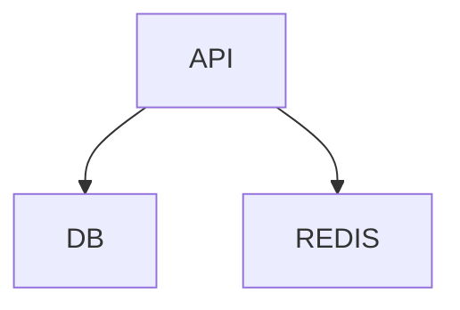

# Repository Documentation

This repository writes documentation to render cleanly on GitHub first.

## Goals

- keep top-level docs readable in the browser
- use Markdown features that GitHub officially supports
- prefer conventions that still work when the repository is cloned locally
- make internal navigation stable across branches

## Preferred Markdown Features

Use these features when they improve clarity:

- headings with a clear hierarchy
- repository-relative links such as `./docs/background-jobs.md`
- tables for package maps, commands, or capability summaries
- fenced code blocks with a language hint such as `sh`, `ts`, or `json`
- GitHub alerts such as `> [!NOTE]` and `> [!IMPORTANT]`
- collapsed sections with `<details>` and `<summary>`
- task lists for roadmap or execution tracking
- Mermaid diagrams for architecture or flow visualization

## Link Rules

- Prefer relative links for files inside the repository.
- Avoid absolute local filesystem paths in Markdown.
- Keep link text on one line so GitHub parses it correctly.
- When linking sections, prefer heading-generated anchors instead of custom HTML anchors unless you need a precise non-heading target.

## Writing Rules

- Keep section titles short and stable so heading anchors do not change often.
- Prefer one topic per section.
- Keep examples close to the code or package they describe.
- Update README files when public package behavior, setup, ownership, or operational flow changes.
- Avoid documenting temporary implementation details unless they matter operationally.

## Suggested Patterns

### Callout

```md
> [!NOTE]
> This package is intended for shared infrastructure concerns only.
```

### Collapsible detail

````md
<details>
<summary>Workspace commands</summary>

```sh
pnpm --filter api test
pnpm --filter worker test
```

</details>
````

### Mermaid

````md

````

## Documentation Map

- Root `README.md`: project overview, architecture snapshot, onboarding links
- `docs/*.md`: cross-cutting operational topics
- `packages/*/README.md`: package ownership, APIs, usage, and validation
- `.codex/*`: AI-assistance rules and project-specific engineering workflows

## References

- [GitHub Docs: Basic writing and formatting syntax](https://docs.github.com/en/get-started/writing-on-github/getting-started-with-writing-and-formatting-on-github/basic-writing-and-formatting-syntax)
- [GitHub Docs: Working with advanced formatting](https://docs.github.com/en/get-started/writing-on-github/working-with-advanced-formatting)
