# Tournament Domain Schema V1

This document describes the first database-oriented domain draft for Tourna tournament management.

The goal is not to lock the final SQL implementation yet. The goal is to preserve the product reasoning, entity boundaries, relationships, and V1 feature scope before translating the model into migrations and typed Kysely schemas.

## Scope

Tourna must support tournament management for esports, sim racing, and traditional competitions.

The V1 model must support:

- independent tournaments created by a user
- tournaments connected to an organization or community
- optional macro events containing multiple tournaments
- team-based and individual tournaments
- scrims and friendlies
- tournament registration
- team membership and tournament-specific rosters
- match-specific lineups
- result submission, confirmation, disputes, and optional evidence
- macro scoring for standings
- future micro statistics for ranking, ELO, MMR, and analytics

The V1 model deliberately avoids:

- mixed team and individual entrants in the same tournament
- global standings across multiple tournaments
- fully custom tournament engines
- automatic team balancing
- ELO, MMR, and ranking calculation
- multi-tournament compensated scoring

Those features should remain possible later without forcing a redesign of the core entities.

## Identifier Strategy

Primary database identifiers use Snowflake-style `bigint` values generated by PostgreSQL.

The migration defines:

- `tourna_snowflake_sequence`
- `generate_snowflake_id()`

The function reads an optional connection setting named `tourna.snowflake_worker_id`.

If the setting is not present, worker `0` is used. Application workers can set a value between `0` and `1023` when opening database connections.

TypeScript represents these IDs as `string`, because PostgreSQL `bigint` values are returned as strings by the Node `pg` driver and JavaScript numbers cannot safely represent every 64-bit integer.

## Core Decisions

### Tournament is the center

`Tournament` is the central competitive unit. It owns entrants, stages, matches, scoring, standings, result flow, and roster participation.

`Event` is optional and should be treated as a macro container, not as a required parent.

```text
Independent creator:
  User -> Tournament

Organization tournament:
  Organization -> Tournament

Large event:
  Organization -> Event -> Tournament
```

This keeps the simple path simple while allowing larger structures like ESL-style events, racing championships, or multi-discipline festivals.

### Event is optional

An event represents a broader container such as a championship, league season, festival, circuit, or showcase.

Examples:

```text
Event: ESL Summer Series
  Tournament: Apex Legends Pro
  Tournament: Rocket League 2v2
  Tournament: iRacing GT3

Event: WEC Weekend
  Tournament: Hypercar
  Tournament: LMP2
  Tournament: GT3
```

If each category has its own prizes and standings, it should be modeled as a separate tournament under the same event.

### Organization is optional

A tournament does not need to belong to an organization.

Independent tournaments should be represented directly through `created_by_user_id` with `organization_id = null` and `event_id = null`.

This avoids forcing every user into a personal organization just to create a scrim, friendly, or small tournament.

### One tournament, one entrant mode

V1 supports:

- `team`
- `individual`

V1 does not support a mixed tournament where some entrants are teams and others are individual users.

If automatic team creation is introduced later, it should happen before registration is finalized, so the tournament can still run in `team` mode.

### One tournament, one standing

Each tournament has its own standing.

If categories have separate rankings, prizes, or winners, they should be represented as separate tournaments. A future global ranking across tournaments can be derived from match data, race data, absolute placement, or explicit score aggregation.

### Tags and constraints are different concepts

Tags describe and classify.

Constraints restrict behavior.

```text
Tag:
  no-profit
  beginner-friendly
  gt3

Constraint:
  only PC players can register
  invite-only registration
  minimum rank required
  only EU users can join
```

This separation keeps discovery and enforcement independent.

### Team membership, roster, and lineup are separate

The model separates long-term team membership from tournament participation and match participation.

```text
TeamMembership:
  who belongs to the team

TournamentRoster:
  who is registered for this tournament

MatchLineup:
  who actually played this match
```

This is required for teams that play multiple games with different rosters, or where only part of the team participates in a specific tournament or match.

### Results can be submitted by admins or participants

If an organizer or admin submits a result, the result can be confirmed automatically.

If a team or player submits a result, the result starts as pending and other participants can confirm or dispute it.

Evidence such as screenshots, videos, links, or files is configurable per tournament.

## Mermaid Entity Relationship Diagram

```mermaid
erDiagram
  USER ||--o{ USER_SESSION : owns
  USER ||--o{ MEMBERSHIP : receives
  USER ||--o{ ORGANIZATION : creates
  USER ||--o{ TEAM : creates
  USER ||--o{ EVENT : creates
  USER ||--o{ TOURNAMENT : creates
  USER ||--o{ RESULT_SUBMISSION : submits
  USER ||--o{ RESULT_CONFIRMATION : confirms
  USER ||--o{ TEAM_MEMBERSHIP : joins
  USER ||--o{ TOURNAMENT_ROSTER_MEMBER : rostered_as
  USER ||--o{ MATCH_LINEUP_MEMBER : plays_as
  USER ||--o{ STAT_EVENT : records_for

  ORGANIZATION ||--o{ MEMBERSHIP : scoped_membership
  ORGANIZATION ||--o{ EVENT : hosts
  ORGANIZATION ||--o{ TOURNAMENT : owns
  ORGANIZATION ||--o{ TEAM : owns

  EVENT ||--o{ MEMBERSHIP : scoped_membership
  EVENT ||--o{ TOURNAMENT : contains
  EVENT ||--o{ CONSTRAINT : restricts

  DISCIPLINE ||--o{ TOURNAMENT : classifies
  DISCIPLINE ||--o{ STAT_DEFINITION : defines

  TOURNAMENT ||--o{ MEMBERSHIP : scoped_membership
  TOURNAMENT ||--o{ TOURNAMENT_TAG : tagged_with
  TAG ||--o{ TOURNAMENT_TAG : applied_to
  TOURNAMENT ||--o{ CONSTRAINT : restricts

  TEAM ||--o{ MEMBERSHIP : scoped_membership
  TEAM ||--o{ TEAM_MEMBERSHIP : has_member
  TEAM ||--o{ TOURNAMENT_ENTRANT : enters_as_team

  TOURNAMENT ||--o{ TOURNAMENT_ENTRANT : registers
  TOURNAMENT ||--o{ TOURNAMENT_ROSTER : has_roster
  TOURNAMENT_ENTRANT ||--o{ TOURNAMENT_ROSTER : represented_by
  TOURNAMENT_ROSTER ||--o{ TOURNAMENT_ROSTER_MEMBER : includes

  TOURNAMENT ||--o{ STAGE : has
  TOURNAMENT ||--o{ MATCH : schedules
  STAGE ||--o{ MATCH : contains

  MATCH ||--o{ MATCH_PARTICIPANT : has
  TOURNAMENT_ENTRANT ||--o{ MATCH_PARTICIPANT : participates
  MATCH ||--o{ MATCH_LINEUP : has_lineup
  TOURNAMENT_ENTRANT ||--o{ MATCH_LINEUP : fields
  MATCH_LINEUP ||--o{ MATCH_LINEUP_MEMBER : includes

  MATCH ||--o{ RESULT_SUBMISSION : receives
  TOURNAMENT_ENTRANT ||--o{ RESULT_SUBMISSION : submits_as
  RESULT_SUBMISSION ||--o{ RESULT_CONFIRMATION : needs
  RESULT_SUBMISSION ||--o{ RESULT_EVIDENCE : supports
  TOURNAMENT_ENTRANT ||--o{ RESULT_CONFIRMATION : confirms_as

  SCORING_PROFILE ||--o{ TOURNAMENT : configures
  TOURNAMENT ||--o{ SCORE_AWARD : awards
  MATCH ||--o{ SCORE_AWARD : produces
  TOURNAMENT_ENTRANT ||--o{ SCORE_AWARD : receives
  TOURNAMENT ||--o{ STANDING : ranks
  STAGE ||--o{ STANDING : ranks_within
  TOURNAMENT_ENTRANT ||--o{ STANDING : appears_in

  STAT_DEFINITION ||--o{ STAT_EVENT : describes
  TOURNAMENT ||--o{ STAT_EVENT : collects
  MATCH ||--o{ STAT_EVENT : produces
  TOURNAMENT_ENTRANT ||--o{ STAT_EVENT : credited_to

  USER {
    snowflake_id id PK
    string email
    string display_name
    datetime created_at
  }

  USER_SESSION {
    snowflake_id id PK
    snowflake_id user_id FK
    datetime expires_at
  }

  MEMBERSHIP {
    snowflake_id id PK
    snowflake_id user_id FK
    membership_scope_type scope_type
    snowflake_id scope_id
    membership_role_code role_code
    membership_status status
  }

  ORGANIZATION {
    snowflake_id id PK
    snowflake_id created_by_user_id FK
    string name
    organization_type type
    organization_status status
    datetime created_at
  }

  EVENT {
    snowflake_id id PK
    snowflake_id organization_id FK
    snowflake_id created_by_user_id FK
    string name
    event_type type
    lifecycle_status status
    datetime starts_at
    datetime ends_at
  }

  DISCIPLINE {
    snowflake_id id PK
    string name
    discipline_kind kind
  }

  TAG {
    snowflake_id id PK
    string label
  }

  TOURNAMENT_TAG {
    snowflake_id tournament_id FK
    snowflake_id tag_id FK
  }

  CONSTRAINT {
    snowflake_id id PK
    constraint_scope_type scope_type
    snowflake_id scope_id
    constraint_type type
    json config_json
  }

  TEAM {
    snowflake_id id PK
    snowflake_id created_by_user_id FK
    snowflake_id organization_id FK
    string name
    lifecycle_status status
    datetime created_at
  }

  TEAM_MEMBERSHIP {
    snowflake_id id PK
    snowflake_id team_id FK
    snowflake_id user_id FK
    team_membership_role role
    membership_status status
    datetime joined_at
    datetime left_at
  }

  TOURNAMENT {
    snowflake_id id PK
    snowflake_id organization_id FK
    snowflake_id event_id FK
    snowflake_id created_by_user_id FK
    snowflake_id discipline_id FK
    snowflake_id scoring_profile_id FK
    string name
    tournament_type type
    participant_mode participant_mode
    tournament_format format
    lifecycle_status status
    evidence_policy evidence_policy
    datetime starts_at
    datetime ends_at
  }

  TOURNAMENT_ENTRANT {
    snowflake_id id PK
    snowflake_id tournament_id FK
    entrant_type entrant_type
    snowflake_id entrant_id
    entrant_status status
    int seed
  }

  TOURNAMENT_ROSTER {
    snowflake_id id PK
    snowflake_id tournament_id FK
    snowflake_id entrant_id FK
    string name
    roster_status status
  }

  TOURNAMENT_ROSTER_MEMBER {
    snowflake_id id PK
    snowflake_id roster_id FK
    snowflake_id user_id FK
    roster_member_role role
    membership_status status
  }

  STAGE {
    snowflake_id id PK
    snowflake_id tournament_id FK
    string name
    stage_type type
    int order_index
    lifecycle_status status
  }

  MATCH {
    snowflake_id id PK
    snowflake_id tournament_id FK
    snowflake_id stage_id FK
    match_type type
    match_status status
    datetime scheduled_at
  }

  MATCH_PARTICIPANT {
    snowflake_id id PK
    snowflake_id match_id FK
    snowflake_id entrant_id FK
    int slot
    decimal score
    int placement
    boolean is_winner
    participant_result_status result_status
  }

  MATCH_LINEUP {
    snowflake_id id PK
    snowflake_id match_id FK
    snowflake_id entrant_id FK
  }

  MATCH_LINEUP_MEMBER {
    snowflake_id id PK
    snowflake_id lineup_id FK
    snowflake_id user_id FK
    lineup_member_role role
  }

  RESULT_SUBMISSION {
    snowflake_id id PK
    snowflake_id match_id FK
    snowflake_id submitted_by_user_id FK
    result_submitter_type submitted_by_type
    snowflake_id entrant_id FK
    result_submission_status status
    json payload_json
    datetime created_at
  }

  RESULT_CONFIRMATION {
    snowflake_id id PK
    snowflake_id submission_id FK
    snowflake_id entrant_id FK
    snowflake_id confirmed_by_user_id FK
    result_confirmation_status status
    string note
  }

  RESULT_EVIDENCE {
    snowflake_id id PK
    snowflake_id submission_id FK
    snowflake_id uploaded_by_user_id FK
    evidence_type type
    string url
    json metadata_json
  }

  SCORING_PROFILE {
    snowflake_id id PK
    string name
    scoring_mode mode
    json config_json
  }

  SCORE_AWARD {
    snowflake_id id PK
    snowflake_id tournament_id FK
    snowflake_id match_id FK
    snowflake_id entrant_id FK
    score_award_source_type source_type
    decimal points
    string reason
  }

  STANDING {
    snowflake_id id PK
    snowflake_id tournament_id FK
    snowflake_id stage_id FK
    snowflake_id entrant_id FK
    decimal points
    int wins
    int draws
    int losses
    int played
    int rank
    json tiebreakers_json
  }

  STAT_DEFINITION {
    snowflake_id id PK
    snowflake_id discipline_id FK
    string code
    stat_value_type value_type
  }

  STAT_EVENT {
    snowflake_id id PK
    snowflake_id tournament_id FK
    snowflake_id match_id FK
    snowflake_id entrant_id FK
    snowflake_id user_id FK
    snowflake_id stat_definition_id FK
    decimal numeric_value
    string text_value
    boolean boolean_value
    int duration_ms
    json metadata
  }
```



## Enum Conventions

Enum-like fields are written as domain types in the diagram instead of generic `string`.

This is intentional. In the real DB implementation, these fields should be `text` columns with `CHECK` constraints for V1. Native PostgreSQL enums can be introduced later only for values that are truly stable.

Examples:

- `membership_scope_type`
- `membership_role_code`
- `organization_type`
- `event_type`
- `discipline_kind`
- `tournament_type`
- `participant_mode`
- `tournament_format`
- `lifecycle_status`
- `match_status`
- `scoring_mode`

Some enums can be reused across entities when the lifecycle meaning is the same. Others should stay entity-specific when the allowed values represent domain rules.

## Entity Notes

### User and sessions

`User` and `UserSession` already exist conceptually in the project.

`User` represents the account. `UserSession` represents authentication state and should remain separate from tournament logic.

### Membership, roles, and permissions

`Membership` is a scoped authorization relationship between a user and a target scope.

Supported scopes:

- `global`
- `organization`
- `team`
- `event`
- `tournament`

Examples:

```text
User A is org_moderator in Organization X
User A is player in Team Red
User A is captain in Team Blue
User B is global_admin
```

V1 should use fixed role codes stored in the membership record. Policy enforcement should stay in code.

Suggested role codes:

- `global_admin`
- `org_owner`
- `org_admin`
- `org_moderator`
- `team_owner`
- `team_captain`
- `player`
- `coach`
- `manager`

### Organization

`Organization` represents a community, company, club, or organizer.

It is optional for tournament creation. A tournament can be independent when `organization_id` is null.

### Event

`Event` is a macro container. It exists only when useful.

Good use cases:

- championship season
- esports festival
- racing weekend
- league circuit
- multi-tournament showcase

Bad use cases:

- forcing every tournament to have a parent event
- modeling categories with separate standings inside one tournament

### Discipline

`Discipline` represents the game or sport.

Examples:

- Apex Legends
- iRacing
- Rocket League
- Football
- Chess

For V1, a tournament has one discipline. A future multi-discipline tournament can be handled by allowing `Match` to override the discipline, but this should not be part of the first implementation unless needed.

### Tags

Tags are descriptive labels used for search, filtering, discovery, and presentation.

Examples:

- `no-profit`
- `beginner-friendly`
- `gt3`
- `weekly`
- `charity`

Tags should not enforce registration rules.

### Constraints

Constraints are enforceable rules.

Examples:

```json
{
  "type": "platform_only",
  "config": {
    "platform": "pc"
  }
}
```

```json
{
  "type": "invite_only",
  "config": {
    "enabled": true
  }
}
```

Constraint evaluation belongs to application/domain logic, not directly inside the raw database model.

### Team and team membership

`Team` represents a persistent competitive identity.

`TeamMembership` represents users belonging to the team, independently from a specific tournament.

A user can belong to multiple teams at the same time with different roles.

### Tournament

`Tournament` is the core aggregate for V1 competition management.

Suggested values:

```text
type:
  tournament
  league
  scrim
  friendly
  qualifier
  championship

participant_mode:
  team
  individual

format:
  single_elimination
  round_robin
  points_league
  scrim

status:
  draft
  published
  registration_open
  live
  completed
  cancelled

evidence_policy:
  none
  optional
  required
```

### Tournament entrant

`TournamentEntrant` represents a participant registered in a tournament.

The entrant can be:

- a `Team`
- a `User`

The tournament's `participant_mode` determines which entrant type is valid.

V1 should enforce:

```text
participant_mode = team       -> entrant_type must be team
participant_mode = individual -> entrant_type must be user
```

### Tournament roster

`TournamentRoster` represents the users from a team who participate in a specific tournament.

This matters because a team can have many members and different rosters for different games, events, or tournaments.

For individual tournaments, a roster may not be needed.

### Match lineup

`MatchLineup` represents the users who actually played a specific match.

This is different from tournament roster because substitutes, absences, and match-by-match selections are common.

### Stage and match

`Stage` groups matches inside a tournament.

Examples:

- group phase
- playoffs
- round 1
- race 1
- final
- scrim session

`Match` is the generic competitive unit. Depending on discipline and format, it can represent:

- match
- race
- heat
- fixture

### Result submission and confirmation

`ResultSubmission` stores a proposed result.

`ResultConfirmation` stores participant confirmation or dispute.

`ResultEvidence` stores optional proof such as screenshot, video, link, or file.

Rules:

```text
If an admin or organizer submits a result:
  the result can be confirmed automatically.

If a participant submits a result:
  the result starts pending.
  other participants can confirm or dispute it.

If the tournament evidence policy is required:
  participant submissions must include at least one evidence record.
```

Suggested submission statuses:

```text
pending
confirmed
disputed
rejected
```

### Scoring profile

`ScoringProfile` configures how macro points are produced.

V1 should support pragmatic predefined modes with JSON configuration, not a fully custom rule engine.

Suggested modes:

```text
win_loss
placement_points
points_league
hybrid
```

Examples:

```json
{
  "mode": "win_loss",
  "points": {
    "win": 3,
    "draw": 1,
    "loss": 0
  }
}
```

```json
{
  "mode": "placement_points",
  "placements": {
    "1": 25,
    "2": 18,
    "3": 15
  }
}
```

```json
{
  "mode": "hybrid",
  "placementPoints": {
    "1": 12,
    "2": 9,
    "3": 7
  },
  "statPoints": {
    "kill": 1
  }
}
```

### Score award and standing

`ScoreAward` is the audit-friendly source of assigned points.

`Standing` is the current ranking table for display and fast reads.

This gives two useful properties:

- standings can be recalculated from score awards
- manual bonuses, penalties, and admin adjustments remain traceable

Suggested score award sources:

```text
match_result
manual_bonus
penalty
admin_adjustment
```

### Stat definition and stat event

`StatDefinition` describes a stat for a discipline.

`StatEvent` stores micro scoring and statistical facts.

Examples:

```text
Apex Legends:
  kill
  assist
  placement

Football:
  goal
  assist
  yellow_card

iRacing:
  lap_time
  fastest_lap
  penalty
  race_time
```

V1 does not need to calculate ELO or MMR. It should store enough structured facts to support those systems later.

## Feature Flows

### Independent scrim

```text
User creates Tournament
Tournament has organization_id = null
Tournament has event_id = null
Tournament type = scrim
Tournament format = scrim
Teams register as entrants
Participants submit result
Other team confirms or disputes
Evidence is optional, required, or disabled based on evidence_policy
```

### Organization tournament

```text
User creates Organization
Organization creates Tournament
Organization members manage registration, matches, results, and disputes
Teams or users register as entrants
Admin submitted results are confirmed automatically
Standings update from score awards
```

### Multi-tournament event

```text
Organization creates Event
Event contains multiple Tournaments
Each Tournament has its own entrants, matches, scoring, and standings
Future global event standings can be derived separately if needed
```

### Team with multiple rosters

```text
Team has users A, B, C, D, E

Tournament Apex:
  roster A, B, C

Tournament Valorant:
  roster C, D, E

Match final:
  lineup C, D, E
```

## V1 Implementation Boundaries

When this design is translated into code:

- persistence schema belongs in `packages/db`
- domain vocabulary and enum-like concepts should live in `packages/domain`
- request and response validation should live in `packages/contracts`
- NestJS modules and orchestration should live in `apps/api`
- UI flows should live in `apps/web`

The database should store durable facts and relationships. It should not become the place where tournament rules are hidden as ad hoc SQL behavior.

## Open V2 Extensions

This schema intentionally leaves room for:

- double elimination
- swiss format
- automatic bracket generation
- automatic round robin scheduling
- global event standings
- compensated cross-category scoring
- ELO and MMR calculation
- ranking by discipline
- ranking by organization
- ranking by team or player
- discipline-specific match payloads
- richer dispute workflows
- upload storage providers for evidence
- automatic team formation from individual users

## Suggested V1 Build Order

1. Model users, roles, permissions, memberships, organizations, and teams.
2. Add tournaments with optional organization and event ownership.
3. Add tournament entrants for team and individual modes.
4. Add tournament rosters and match lineups.
5. Add stages, matches, and match participants.
6. Add result submission, confirmation, dispute, and evidence.
7. Add scoring profiles, score awards, and standings.
8. Add stat definitions and stat events only when the first stats UI or API is ready.

## Final V1 Summary

The V1 model uses `Tournament` as the core entity and keeps `Organization` and `Event` optional.

It supports both team and individual competitions without allowing mixed entrant modes in the same tournament. It separates tags from constraints, separates team membership from tournament roster and match lineup, and preserves result evidence and score awards for future audit, statistics, and ranking systems.

This gives Tourna a practical first database structure without blocking larger esports, sim racing, or traditional competition workflows later.
